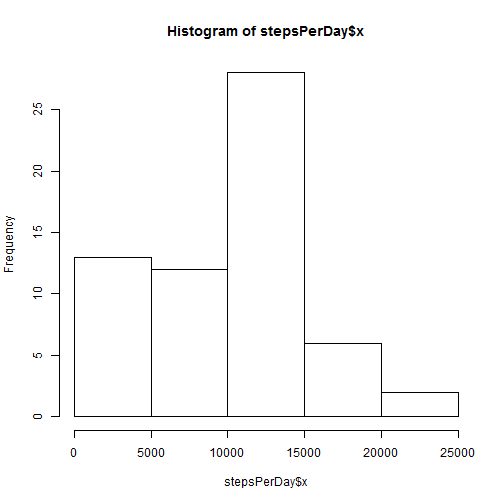
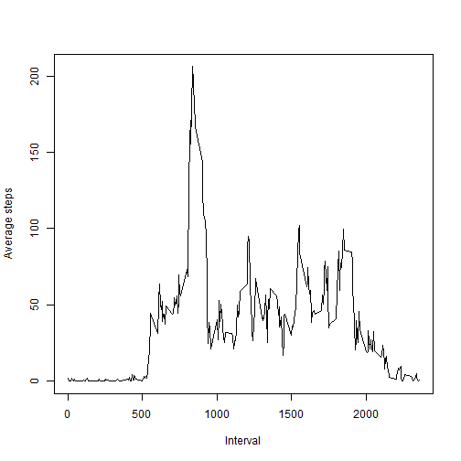
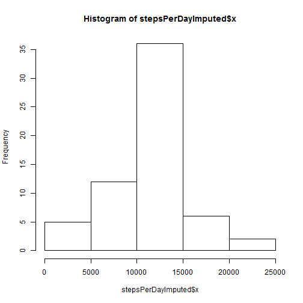
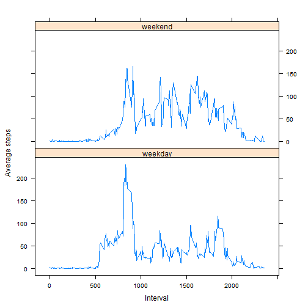

##Loading and preprocessing the data

```r
#Download, unzip and read the data and load necessary packages
download.file("https://d396qusza40orc.cloudfront.net/repdata%2Fdata%2Factivity.zip", "Dataset.zip")
ziplist <- unzip("Dataset.zip")
activity <- read.csv(ziplist[1], na.strings = "NA")
library(dplyr)
library(chron)
library(lattice)
```
##What is mean total number of steps taken per day?

```r
#Calculate the total number of steps taken per day
stepsPerDay <- aggregate(activity$steps, list(activity$date), sum, na.rm=TRUE)
#Make a histogram of the total number of steps taken each day
hist(stepsPerDay$x)
```



```r
#Calculate the mean of the total number of steps taken per day
mean(stepsPerDay$x)
```

```
## [1] 9354.23
```

```r
#Calculate the median of the total number of steps taken per day
median(stepsPerDay$x)
```

```
## [1] 10395
```
##What is the average daily activity pattern?

```r
#Make a time series plot (i.e. type = "l") of the 5-minute interval (x-axis) and the average number of steps taken, averaged across all days (y-axis)
stepsPerInterval <- aggregate(activity$steps, list(activity$interval), mean, na.rm=TRUE)
plot(stepsPerInterval$Group.1, stepsPerInterval$x, type="l", ylab = "Average steps", xlab = "Interval")
```



```r
#Which 5-minute interval, on average across all the days in the dataset, contains the maximum number of steps?
stepsPerInterval[which.max(stepsPerInterval$x),1]
```

```
## [1] 835
```
##Imputing missing values

```r
#Calculate and report the total number of missing values in the dataset (i.e. the total number of rows with NAs)
sum(is.na(activity$steps))
```

```
## [1] 2304
```

```r
#Devise a function that imputes values based on their mean
impute.mean <- function(x) replace(x, is.na(x), mean(x, na.rm = TRUE))
#Create a new dataset that is equal to the original dataset but with the missing data filled in as the mean for that 5-minute interval (using the dplyr package)
activityImputed <- activity %>% group_by(interval) %>% mutate(steps = impute.mean(steps))
#Calculate the total number of steps taken each day (imputed data)
stepsPerDayImputed <- aggregate(activityImputed$steps, list(activityImputed$date), 
                                sum, na.rm=TRUE)
#Make a histogram of the total number of steps taken each day (imputed data)
hist(stepsPerDayImputed$x)
```



```r
#Calculate the mean of the total number of steps taken per day (imputed data)
mean(stepsPerDayImputed$x)
```

```
## [1] 10766.19
```

```r
#Calculate the median of the total number of steps taken per day (imputed data)
median(stepsPerDayImputed$x)
```

```
## [1] 10766.19
```
##Are there differences in activity patterns between weekdays and weekends?

```r
#Create a new factor variable in the imputed dataset with two levels - "weekday" and "weekend" indicating whether a given date is a weekday or weekend day (using chron package)
activityImputed$weekDayEnd <- as.factor(is.weekend(activityImputed$date))
levels(activityImputed$weekDayEnd)[levels(activityImputed$weekDayEnd)=="FALSE"] <- "weekday"
levels(activityImputed$weekDayEnd)[levels(activityImputed$weekDayEnd)=="TRUE"] <- "weekend"
#Calculate the mean number of steps taken per interval for weekends and weekdays (imputed data)
stepsPerWeekDayImputed <- aggregate(activityImputed$steps, 
                                    list(activityImputed$interval,
                                         activityImputed$weekDayEnd), 
                                    mean, na.rm=TRUE)
#Make a panel plot containing a time series plot of the 5-minute interval (x-axis) and the average number of steps taken, averaged across all weekdays or weekend days (y-axis) using the lattice package
xyplot(x ~ Group.1 | Group.2, data = stepsPerWeekDayImputed, type = "l", layout = c(1,2), 
       xlab = "Interval", ylab = "Average steps")
```


